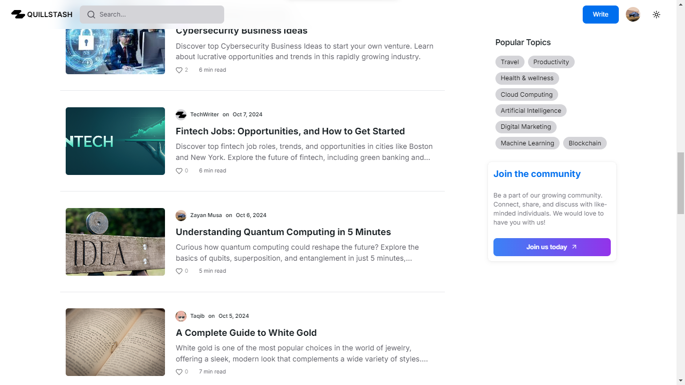

## Project Overview

Quillstash is a content writing site I developed together with [Ibrahim](https://ibrahimdoba.vercel.app) for [quillstash](https://quillstash.com), It was supposed to be our first shot at a saas but we decided to turn it to a learning opportunity learning about SEO, keyword/trend research, site optimizations etc. Since we first went live in september 2024 we've gathered over 3000 page views in less than 30 days.

## Objectives

1. Develop a user-friendly website that is easy to navigate and a reading experience thats simple and ad free.

2. Provide a simple and intuitive editing experience for writers

3. Build an active and supportive community around the platform  

## Features

1. **Dynamic OpenGraph image generation:**

    - OpenGraph images are auto generated for each post featuring the authors name and article title.
    - OpenGraph descriptions are auto generated for each article using AI if omitted by the author.

2. **Pretty simple and modern UI:** Quillstash unlike most content publishing platforms is really simple and easy to navigate

3. **Simple editor:** We have a very simple text editor for authoring content.

4. **Discord Bot:** In efforts to build a community I developed a discord bot to notify the discord server whenever anyone publishes an article.

## Technology Stack

- [Nextjs](https://nextjs.org): For its fullstack, SSG, and SSR capabilities.
- [TailwindCSS](https://tailwindcss.com): For styling the site.
- [Drizzle ORM](https://drizzle.team): Typescript ORM for Postgres databases we used neonDB.
- [Gemini](https://ai.google.dev/gemini-api): Googles ai model used for OG description generation.
- [Semrush](https://www.semrush.com): For keyword research

## Outcome

We were able to develop a fullstack content platform using cutting edge technologies, We've been able to retain about 10 active writers so far and the community is growing steadily, using tools like semrush weve published SEO optimized content driving visitors leading to over 10,000 page views in less than 3 months.
