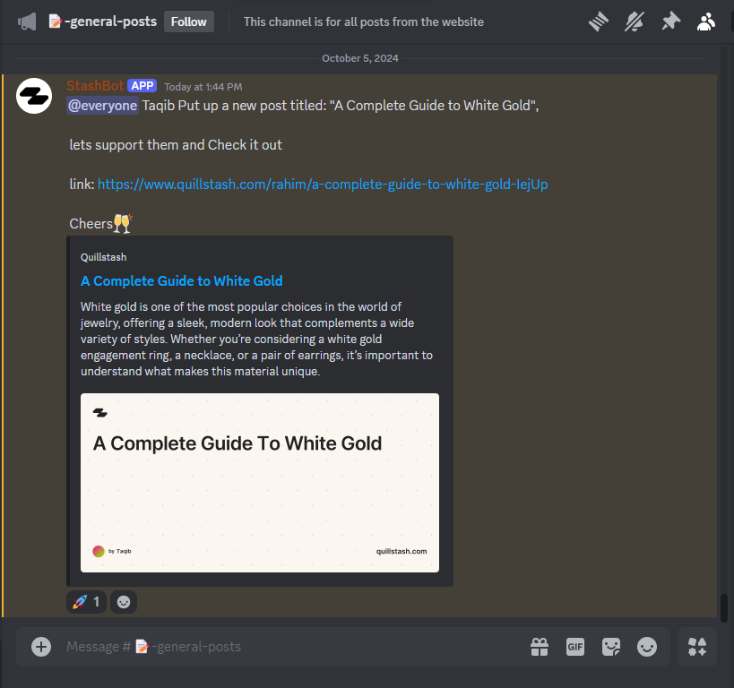

## Project Overview

Stashbot is a support bot I developed for [quillstash](https://quillstash.com) to enhance community engagement within the platform’s Discord server. Its primary function is to notify members of new uploads on the site, encouraging interaction with content, regardless of who the author is. This fosters a more connected and active community. Additionally, I integrated Google's Gemini AI, providing server members with easy access to a chatbot directly within Discord, offering them real-time support and interaction.

## Objectives

1. **Enhance Community Engagement:** Increase interaction within the Discord server by notifying members of new content uploads on Quillstash, encouraging more readers and discussions.

2. **Foster a Supportive Writing Environment:** Create a space where every author’s content is highlighted equally, fostering a sense of community and shared growth among members.

3. **Provide Seamless AI Assistance:** Integrate Google's Gemini to offer users a convenient, AI-driven chatbot for real-time support and interaction, improving the overall server experience.

## Features

1. **Real-time notification:** Stashbot notifies the sever or new articles as soon as the author publishes it.
2. **Slash commands:** Stashbot supports slash commands such as `/prompt` for chatting with google's gemini.

## Technology Stack

- [Hono](https://hono.dev): Nodejs framework for handling the backend logic and api routes for the site to communicate with.
- [Discordjs](https://discord.js.org): for easy interaction with the Discord API
- [Google's gemini](https://ai.google.dev/gemini-api): for chat/text generation features.
- [Typescript](https://typescriptlang.org): Obviously.

## Further development

I’ve been thinking of adding a feature that keeps track of how many posts each writer publishes. It’s a fun way to build a reward system on the server, where the bot could celebrate active writers and let everyone know about their achievements. I think it would be a cool way to motivate the community and give writers the recognition they deserve. Plus, it would add a bit of friendly competition, which could encourage more engagement!
